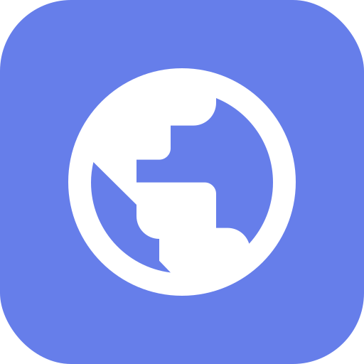

# AI Chat Studio v2.0.0

**The Future of Multi-Model AI Chat Interfaces**

AI Chat Studio v2.0.0 is a groundbreaking multi-model AI chat interface that revolutionizes how users interact with AI services online. Experience seamless switching between multiple AI providers with a modern, privacy-first design.



## Features

- **Multi-Model Support**: Chat with Gemini, Claude, GPT, and DeepSeek in one interface
- **Modern UI**: VS Code-inspired design with dark/light themes
- **Privacy-First**: All data stored locally in your browser
- **Secure API Keys**: Local encryption, never sent to servers
- **File Uploads**: Analyze documents and images with AI
- **Markdown Support**: Full rendering with syntax highlighting
- **Voice Controls**: Speech-to-text and text-to-speech
- **Export Functionality**: Multiple export formats (JSON, Text, Markdown)
- **Responsive Design**: Perfect on desktop, tablet, and mobile
- **Progressive Web App**: Offline functionality and install prompts

## Quick Start

### For Users

1. **Live Demo**: Visit [http://localhost:8001](http://localhost:8001) to try the live demo
2. **Choose AI Model**: Select from Gemini, Claude, GPT, or DeepSeek
3. **Enter API Key**: Securely store your API key locally
4. **Start Chatting**: Begin conversations with any supported AI model

### For Developers

1. **Clone the Repository**
   ```bash
   git clone [repository-url]
   cd ai-chat-studio
   ```

2. **Local Development**
   ```bash
   cd v2.0.0
   php -S localhost:8001
   ```

3. **Access**: Open your browser to `http://localhost:8001`

## Documentation

Detailed documentation is available in the `/docs` directory:

- [Installation Guide](docs/installation.html) - Complete setup instructions
- [Hosting Tutorial](docs/hosting-tutorial.html) - How to host on web servers and shared hosting
- [User Guide](docs/user-guide.html) - Detailed user instructions
- [API Documentation](docs/api.html) - Technical API reference
- [Troubleshooting](docs/troubleshooting.html) - Common issues and solutions

## Browser Requirements

- **Chrome** 90+ (recommended)
- **Firefox** 88+
- **Safari** 14+
- **Edge** 90+
- **JavaScript** enabled
- **Local Storage** support

## System Requirements

- **Memory**: 4GB+ RAM recommended
- **Storage**: 50MB+ browser storage
- **Internet**: Stable connection for AI API communication
- **Optional**: Microphone access for voice features

## Privacy & Security

- **Local-Only Storage**: No server data collection
- **Encrypted API Keys**: Browser-based key management
- **No Tracking**: Complete privacy protection
- **GDPR Compliant**: Privacy-first architecture
- **Open Source**: Transparent and auditable code

## Supported AI Models

| Provider | Model | Status | Setup |
|----------|-------|--------|-------|
| Google | Gemini Pro | Active | [Get API Key](https://aistudio.google.com) |
| Anthropic | Claude | Active | [Get API Key](https://console.anthropic.com) |
| OpenAI | GPT-4/GPT-3.5 | Active | [Get API Key](https://platform.openai.com) |
| DeepSeek | DeepSeek Coder | Active | [Get API Key](https://platform.deepseek.com) |

## Contributing

We welcome contributions! Please see our contributing guidelines for more information.

### Development Setup

1. Fork the repository
2. Create a feature branch
3. Make your changes
4. Test thoroughly
5. Submit a pull request

## License

This project is licensed under the MIT License - see the [LICENSE](LICENSE) file for details.

## Support

- **Issues**: Report bugs and request features via GitHub Issues
- **Documentation**: Check the `/docs` directory for detailed guides
- **Community**: Join our community discussions

## Developer Notes

**Recent Improvements:** The documentation has been updated with Font Awesome icons replacing traditional emojis for a more professional and consistent user experience across all documentation pages. This enhancement improves accessibility, scalability, and maintains visual consistency throughout the project.

## Changelog

See [CHANGELOG.md](CHANGELOG.md) for detailed version history and new features.

## Roadmap

### v2.1.0 (Planned)
- Enhanced file upload with drag-and-drop
- Improved voice recognition
- Additional AI model integrations
- Advanced export options

### v2.2.0 (Planned)
- Real-time collaboration
- Advanced conversation organization
- Plugin architecture
- Cloud sync capabilities

---

**AI Chat Studio v2.0.0** - Where AI models unite. Experience the future of chat!

Developed by Taher